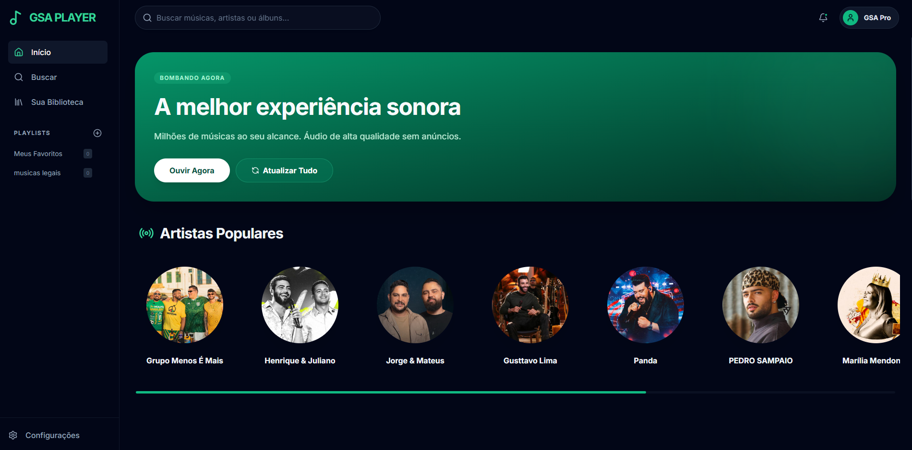
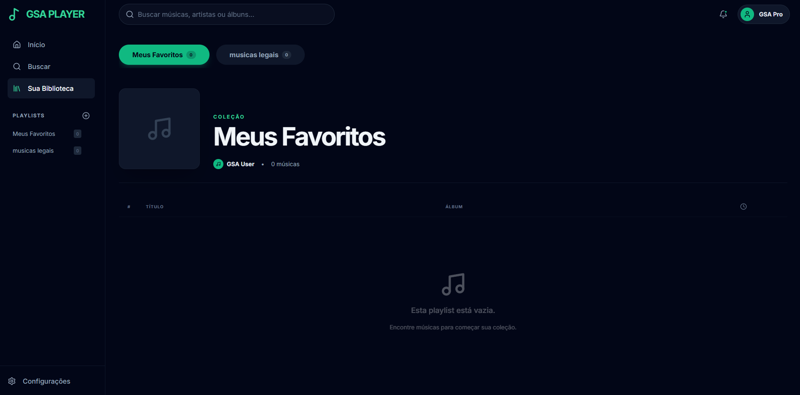

🎵 GSA Player
O GSA Player é uma plataforma de streaming de música moderna e minimalista, desenvolvida com React e integrada à API do Deezer. O projeto foca em uma experiência de usuário (UX) fluida, com uma interface glassmorphic elegante, suporte total a playlists personalizadas e descoberta inteligente de músicas.

📸 Screenshots

   

✨ Funcionalidades
🏠 Home & Descoberta
Infinite Scroll: Explore músicas sem fim com carregamento automático conforme você rola a página.

Refresh Inteligente: O botão "Atualizar Tudo" alterna dinamicamente entre os charts globais e palavras-chave de tendência para sempre trazer novidades.

Artistas Populares: Seção dedicada aos artistas que estão bombando no momento.

🔍 Busca em Tempo Real
Pesquise por faixas, álbuns ou artistas diretamente na barra de busca superior.

Resultados instantâneos alimentados pela base de dados do Deezer.

📂 Gestão de Playlists (CRUD Completo)
Criação Dinâmica: Crie quantas playlists desejar.

Favoritos: Sistema de "Curtir" que adiciona músicas automaticamente à sua biblioteca principal.

Edição Total: Adicione músicas através de cards, remova faixas individuais ou exclua playlists inteiras.

Persistência: Seus dados são salvos no localStorage.

🎧 Player Avançado
Interface Glassmorphism: Player fixo com efeito de transparência e desfoque.

Controles Completos: Play/Pause, Próxima/Anterior, Shuffle e Repeat.

Interatividade: Barra de progresso clicável e controle de volume fino.

📱 Responsividade Mobile
Mobile-First: Navegação inferior estilo app nativo.

Player Adaptável: Controles redimensionados para telas pequenas.

🛠️ Tecnologias Utilizadas
Core: React 19

Estilização: Tailwind CSS

Ícones: Lucide React

API de Dados: Deezer API

Gerenciamento de Estado: React Context API

Animações: Framer Motion / CSS Animations

🚀 Como Executar o Projeto
Clone o repositório:

Bash
git clone https://github.com/seu-usuario/gsa-player.git
Instale as dependências:

Bash
npm install
Inicie o servidor de desenvolvimento:

Bash
npm start
📝 Roadmap Futuro
[ ] Implementar sistema de letras (Lyrics) em tempo real.

[ ] Adicionar modo offline (PWA).

[ ] Login social para sincronização em nuvem.

[ ] Equalizador de áudio visual com Canvas API.